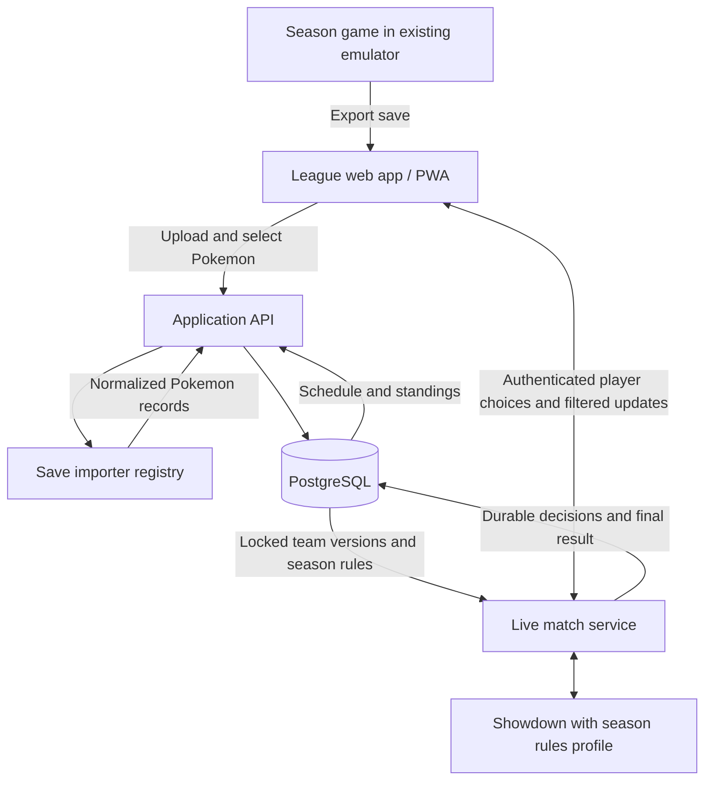
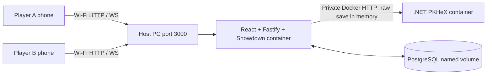

# Pocket Monster Brawl — private leagues and cartridge-powered tournaments

Status: active implementation plan, updated September 12, 2026. The self-hosted LAN build includes a mobile-first installable Trainer Gear interface, account/session flows, league creation, username invitations, membership, tournament setup, private tournament team drafts, immutable team locks, PostgreSQL-backed normalized save snapshots, the real FireRed/PKHeX import path, an explicit Showdown team adapter, and an authenticated two-player Showdown series with journaled decisions, restart reconstruction, scores, and results. Docker Compose is the verified runtime. Local HTTPS, realtime sockets, multi-player bracket execution, LAN discovery, and packaged releases are not complete.

## Product and scope

Friends create accounts and join a persistent private **league**. A league owns its membership and history and can run multiple **tournaments** over time. FireRed is the first supported game profile, not an application-wide restriction. Before an event, members train in their existing games, import an in-game save, and privately save or revise a team draft. At the tournament lock point, the server freezes each final team and the tournament rules, generates a bracket, supplies those immutable teams to matches, and advances winners until a champion is decided.

### Confirmed end-to-end product journey

1. A first-time visitor creates an account; returning players sign in on any supported phone or computer.
2. A player creates a persistent league and becomes its owner, then finds registered players by username and sends in-app invitations.
3. Invited players accept and appear on the league roster. Everyone can see membership and a coarse preparation status, but never another player's draft or final team data.
4. A league owner/admin creates a tournament event and chooses its game profile, format, bracket type, best-of series length, team size, dates, lock point, and item/species rules.
5. Members may import new saves and replace private team drafts at their leisure while registration is open. Saving a draft is not final submission.
6. At the configured lock point (or an explicit, audited admin start), the server validates and freezes one immutable registered-team version per entrant. Late changes require a visible organizer action and create a new version.
7. The server seeds a single-elimination bracket, assigns opponents, and runs each best-of match series using the frozen teams and rules. Players only receive battle information they are allowed to see.
8. Each finished series advances its winner transactionally. The final series winner becomes the tournament champion; the league retains the event, bracket, and match history for future visits.

The whole product uses one portrait Trainer Gear interface: a red, cream, black, and yellow handheld frame with a large screen above working D-pad and A/B controls. LINK, TEAM, CUP, and CARD organize the application; L/R changes modes, direct touch remains available, and the controls can collapse. The live Showdown battle replaces the app content inside the same device instead of switching to a separate controller skin. It is a browser interface, not an emulator. Desktop and wider layouts remain usable.

Confirmed requirements:

- Season-configurable training games and generation-specific battle rules; FireRed with Gen 3 mechanics is the first supported profile.
- The Trainer Gear shell is separate from battle rules and save parsing. Later color themes may change its presentation without changing application or match behavior.
- Preserve actual species/form, level, IVs, EVs, nature, ability, moves, held item, friendship, gender, nickname, and shiny status when mapping into the battle engine.
- Players manually choose moves and switches during live matches.
- Start battles fully healed with Showdown's default maximum move PP. The user accepts this normalization; it must be disclosed when registering a team.
- Teams come from uploaded saves and cannot be edited through a battle team builder.
- Training stays on the existing devices. Battle results do not modify the original save.

First-tournament defaults, editable by the league admin before the tournament opens:

- Invite-only league, six-Pokemon singles, one fixed registered team per player after the deadline.
- Single-elimination bracket with best-of-three match series. Other bracket structures can follow after the first tournament path is complete.
- Actual levels with no automatic scaling. Level cap, legendary restrictions, trading, and competitive clauses need explicit season rules.
- No team preview by default to match the older battle experience; players choose lead/order before starting.
- English FireRed saves first; exact revisions and emulator containers supported only after validation with fixtures.

Not in the initial playable release: automatic battles, asynchronous turns, production support for every generation, ROM hacks, emulator linking, save editing/write-back, native mobile apps, public matchmaking, or a frame-perfect reproduction of FireRed. Extensibility across games and generations is part of the initial architecture and testing; each additional game is enabled after its importer, rules, and UI capabilities pass validation.

## Architecture

The latest interface direction changes the earlier iframe proposal. Use Showdown as a server-side simulator library and reuse its battle-scene renderer beneath our own controls, rather than embedding the complete public Showdown website. A separate full Showdown community server is unnecessary for the MVP.

Showdown receives Pokemon sets and choices, not save files. The raw save is parsed in memory and discarded; its hash, parser version, source metadata, and extracted Pokemon snapshots remain linked to the registered team for audit and debugging. The browser submits a match ID and choices; the server looks up the authenticated player and their locked team.

### Self-hosted LAN deployment target

The confirmed product is a zero-cost, self-hosted LAN application. One host computer at the
event runs the authoritative stack. Players train independently, bring or transfer their
save files, and open the application from phones or computers on the same trusted Wi-Fi.
Only the host installs Docker Desktop and pulls the repository; players install nothing.

The supported runtime is one Docker Compose project with three isolated services:

| Resource | Runtime shape | Responsibility | Exposure |
| --- | --- | --- | --- |
| Web application | Node/Fastify container serving the built React app and Showdown service | Accounts, leagues, uploads, UI, battles, and later WebSockets | One host/LAN port, default `3000` |
| Save parser | Private .NET/PKHeX container | Validate supported saves and return normalized Pokémon | Docker network only |
| Database | PostgreSQL 18 container with a named volume | Accounts, sessions, membership, rules, drafts, locked teams, matches, and results | Docker network only |

The host starts everything with `docker compose up --build --detach` or the supplied OS
launcher. The app applies Drizzle migrations before listening, waits for healthy dependencies,
and serves the browser UI and API from one origin so mobile cookies and WebSockets do not need
cross-origin exceptions. The start script prints both the host URL and a Wi-Fi/LAN URL.

The API accepts a tightly bounded save upload, sends it to PKHeX over the private Docker
network, verifies the response, and discards the raw bytes. PostgreSQL persists only normalized
Pokémon snapshots, provenance, hashes, and team selections in its named volume. Stopping or
upgrading containers must preserve that volume; destructive reset is an explicit separate action.

Showdown runs inside the Node service. Active matches may run in isolated workers later, but
accepted choices must be journaled in PostgreSQL before acknowledgment so an API/container
restart can reconstruct a battle. WebSockets provide live delivery, not permanent truth.

### Game profiles and generation support

Represent a season as a versioned profile with allowed source games, supported revisions/languages, importer adapter versions, battle generation, approved Showdown format/custom rules, team size, level policy, preview policy, restrictions, and normalization policy. FireRed/Gen 3 is seed configuration, not a global constant. Source game and battle generation are distinct fields, but the organizer can select only combinations tested and supported by the application. Cross-generation transfers or mixed-generation teams are not implicitly enabled.

Separate four responsibilities:

- Game adapters detect/read supported saves and retain original generation-specific data plus provenance.
- Battle adapters map those records into the target engine format and perform explicit validation.
- Versioned rules profiles select mechanics and competition policy per season and match.
- UI capability descriptions expose the choices the current rules require; the scene and menus must not assume every generation has abilities, held items, natures, or only Gen 3 actions.

Preserve source-native attributes in a tagged record instead of forcing every game into a Gen 3 schema. Early games need their own DV/stat-experience mapping; later games may require forms, special battle actions, and additional trained attributes. These mappings need fixtures before support is advertised. Configure each season independently, including concurrent seasons, and freeze profile/engine versions for started matches.

An organizer chooses from the enabled game profiles. Adding a game is a bounded adapter-and-validation task, not just a dropdown option. Test the architecture with a second-generation profile and synthetic battle fixtures before the FireRed pilot; use real saves before enabling that profile for players.

### Delta skin compatibility layer

Delta skin packages bundle artwork and JSON descriptions of layouts and controls. Implement an importer that turns a supported `.deltaskin` into an internal skin manifest: asset references, orientation/device variants, screen rectangles, mapping dimensions, hit regions, and logical controls. Our renderer places the custom battle viewport into the skin's screen area and maps controls to navigation/confirm/back/menu actions.

Reuse artwork directly where browser-compatible; convert PDF artwork into browser-ready images during import. CSS remains responsible for positioning and touch overlays, not redrawing the controller artwork. Keep the same scale/offset transform for the art, viewport, and hit regions; preserve aspect ratio, and provide a usable fallback when a skin lacks a suitable layout.

Start with tested single-screen GBA skins, a skin picker, and an importer for the supported subset. Account for both legacy and current screen metadata in the selected fixtures. Additional layouts, dual-screen skins, filters, or special mappings require separate compatibility work. Quick-save/load and fast-forward emulator actions have no battle equivalent and must be disabled or explicitly remapped, never silently treated as actual emulator features. Publish unsupported-feature errors instead of promising universal Delta compatibility.

Treat a skin as inert data: validate archive paths, decompressed size, metadata, and assets; do not execute package code or load external asset URLs. Keep an accessible plain control layout as a fallback. Preserve creator credit and use artwork with suitable permission. User-selected skins are cosmetic and never determine the match generation or give access to hidden battle state.

## Recommended stack

| Layer | Choice | Purpose |
| --- | --- | --- |
| Browser app | React, TypeScript, Vite | League screens and custom battle UI in one codebase |
| Skin rendering and controls | Delta skin importer, image assets, normalized layout JSON, CSS/HTML, Pointer Events and keyboard input | Reuse artwork and mapped button locations; align the custom battle viewport with the skin and retain accessible touch controls |
| Installable app | Web app manifest and service worker, added after live play works | Home-screen installation and cached static shell; battles always require an online connection |
| App API | Node.js 24 LTS, TypeScript, Fastify | Accounts, uploads, teams, seasons, scheduling, and match permissions |
| Live transport | Socket.IO over HTTPS | Rooms, authenticated turn submission, presence, and reconnect transport |
| Battle rules | Pinned `pokemon-showdown` version/commit plus versioned rules-profile registry | Select mechanics per season; isolated simulator worker per active match initially |
| Save parsing | Small internal C#/.NET 10 service using pinned PKHeX.Core behind game adapters | FireRed first, additional validated game adapters later; players never install PKHeX |
| Database | PostgreSQL with Drizzle migrations | Membership, saved teams, rules, match history, action journal, and standings |
| Raw uploads | No persistence by default | Parse bounded saves in memory, retain a one-way hash and normalized snapshots, and discard the original bytes |
| Accounts | Invite-only accounts and revocable server-side sessions | One league identity; browser and live connection share authentication; choose a maintained auth integration during scaffold |
| Verification | Vitest, parser tests, Playwright | Import fidelity, battle command handling, two-player browser flows, and reconnects |
| Runtime | Docker Compose on one host PC | One-command LAN startup, private parser/database networking, health checks, and persistent PostgreSQL storage without paid services |

No Redis, queue, cloud account, or multi-server orchestration is required. Keep the simulator behind an adapter so game rules, transport, and rendering stay separate. The API, static UI, and match service live in one Node container; the parser and PostgreSQL remain private containers.

## Data and integrity

Core records: users, sessions, leagues, memberships, league invitations, tournaments, immutable tournament-rule versions, tournament entries, private team drafts, save-import metadata, source-tagged Pokemon snapshots, registered-team versions, bracket match series, battles, accepted battle decisions, and results.

Each registered team references the source-save fingerprint, importer provenance, and immutable Pokemon snapshots—not retained raw save bytes. Re-uploading creates a new candidate version and never changes a team already used by a match. Registration can be replaced before the deadline; after lock, changes require a visible organizer action and new version. A match records both team versions, rules version, engine version, and a server-only random seed.

Store the underlying values, not just a Showdown text export: explicitly supply every IV and EV, including zero, plus actual level and friendship. Preserve raw-Pokemon fingerprints and relevant parser provenance separately from simulator inputs without retaining the entire save. Do not imply that a Pokemon identifier or hash proves genuine training: uploaded saves can be edited outside our app. Season one uses an honor system for that; the app enforces what happens after submission.

Validate the save contents, supported game, save integrity, and available Pokemon rather than trusting a `.sav` or `.srm` extension. Give actionable errors for emulator snapshots, damaged/incomplete saves, or unsupported containers. Egg, empty, or invalid slots cannot register. Validate Pokemon and league rules explicitly before sending a team to Showdown; its direct simulator API does not validate teams automatically.

## Build sequence and acceptance gates

### 0. Establish configurable profiles and test skin import

- Define the versioned game/rules profile, game adapter contract, source-tagged Pokemon model, and battle UI capabilities. Seed FireRed/Gen 3 as the first profile.
- Add tests with a second generation's profile proving rule selection is per match, generation-specific fields are retained, and unsupported source-game/rules combinations are rejected. Synthetic fixtures do not confer production game support.
- Obtain one custom Delta skin with suitable reuse permission. Inspect its metadata, render its artwork, show the battle viewport at the declared position, and make its D-pad/A/B regions trigger logical controls.
- Validate matching artwork and hit regions on different viewport sizes. Document supported package features and actionable errors for unsupported ones.

Done when: rule selection is driven by profile data, two synthetic profiles can coexist without changing global state, and one real skin renders with aligned functional controls. Without a supplied/approved skin, develop against a labeled fixture and keep the real-skin gate open.

### 1. Prove one FireRed save can become a faithful battle team

- Obtain a user-provided exported save, emulator name, and game revision if known. Collect another save from a different emulator before declaring cross-device support.
- Implement the FireRed game adapter in the parser registry and extract party and PC-box Pokemon, including raw values and source slots.
- Map selected Pokemon into explicit Showdown sets; run the engine using the FireRed profile's Gen 3 rules.
- Compare all six calculated battle stats and the supported trained attributes to independently checked FireRed/PKHeX values. Include imperfect IVs, zero values, mixed EVs, non-100 levels, nature changes, and friendship-dependent moves in fixtures.
- Verify that neither the importer nor the selected format silently changes level, IVs, EVs, friendship, or moves. Review the agreed HP/status/PP normalization separately.

Done when: actual Pokemon from a real save enter a local simulated battle with a written field-by-field comparison and no unexplained mismatch. If sample files are unavailable, use labeled synthetic fixtures to begin development, but keep this acceptance gate open.

### 2. Prove a live two-player battle

- Scaffold the TypeScript app and internal parser contract; load the season's versioned rules profile, initially FireRed/Gen 3.
- Create matches from server-owned teams using the Showdown simulator API.
- Build a plain functional battle screen first: combatants, HP/status, battle log, move choices, party selection, and waiting state.
- Implement legal choices from the engine's requests, including forced switches, disabled moves, trapping, fainted Pokemon, and no-PP/Struggle cases. Do not duplicate battle logic in the client.
- Send each player only their authorized view. Filter private requests and split messages; keep opponent unrevealed moves, exact hidden stats, submitted decisions, and the random seed server-side.
- Use turn/request IDs and idempotent submissions to reject duplicate, stale, or out-of-turn choices. A confirmed choice cannot be changed in the first version; B backs out before confirmation.

Done when: two separate browser sessions complete a manual battle with the right legal choices and synchronized results, without leaking private team data or accepting a replacement team from the browser.

### 3. Add uploads, registration, and membership

- Add invite-only sign-in, membership and organizer permissions.
- Build upload instructions per tested emulator and an owned-save upload endpoint with size bounds and parser timeouts.
- Create party/box browsing, Pokemon detail inspection, profile-sized team selection (six initially), lead/order selection, and a registration confirmation. Show only attributes applicable to the source game.
- Display the source attributes read-only and the accepted match normalization. Allow selection only from the user's permitted uploads.
- Add roster deadlines and immutable registration versions. Keep entire saves private; expose only approved team information to opponents.

Done when: a player uploads their own save, registers a team, and later joins a match that uses that exact registered version. A second player cannot access or register the first player's private save.

### 4. Build the Trainer Gear battle experience

- Use the same red Trainer Gear frame, proportions, safe-area handling, collapse preference, and physical controls across league workflows and live battles.
- Use one selection model for taps, D-pad, keyboard, and A/B so inputs remain consistent. Add hardware gamepad mapping only after testing on actual devices.
- D-pad moves focus; A selects/confirms; B backs out before submission; Select opens the battle menu and Start opens the party during a battle. In application screens, L/R changes mode, Start opens LINK, and Select opens invitations.
- Render Pokemon, health bars, status indicators, turn text, and lightweight attack/faint animations. Evaluate reuse of Showdown's rendering code in a time-boxed spike; do not make completion depend on extracting it successfully. A simpler custom renderer is the fallback.
- Treat simulator events as authoritative and animation as presentation. Reconnect and replay must not depend on completing an animation.
- Respect phone safe areas, portrait and landscape, touch target sizes, reduced motion, and mute controls. Support direct tapping even with controller buttons visible.

Done when: an entire battle is playable with D-pad/A/B and also with direct touch, at phone and desktop sizes, with readable menus and no overlapping controls. Collapsing or restoring the controls preserves battle state and all direct-touch actions.

### 5. Add the season and standings

- Organizer creates a season with an enabled game profile, dates, roster deadline, approved rules, and participants. Freeze rules before play and show FireRed/Gen 3 as a selected profile, never an application-wide restriction.
- Generate pairings using the chosen league format; store match times in UTC and display them in each player's time zone.
- Give each match a page with the opponent, scheduled time, ready state, and Join battle action.
- Persist engine-produced outcomes once and update standings transactionally. Define ties, forfeits, no-shows, and tie-breakers before opening the season.
- Provide a chronological match log/replay view. A public replay must not include unrevealed private team data. Full spectators and elaborate replay controls can follow the pilot.
- Add finals if the selected season format needs them.

Done when: a small test season progresses from registration through completed matches to correct standings, including a duplicate result delivery, tie, and organizer adjudication.

### 6. Reconnect, recovery, and portable LAN release

- Journal accepted decisions durably before acknowledging them. Save initial teams/rules/engine version/seed so a match can be reconstructed by replaying accepted commands under the same pinned engine.
- Use sequence numbers and a fresh authorized state view for client reconnects. Socket.IO recovery is a convenience, not the database or recovery policy.
- Define a configurable disconnect grace period and battle timer. For the pilot, unresolved recovery errors pause the match for organizer review rather than inventing a winner.
- Test page reload, phone backgrounding, connection loss after a move, server restart, duplicate submissions, and a reconnect after the engine has advanced.
- Verify the installable PWA shell on target iPhones. Authenticated API responses and battle commands stay network-only; local HTTPS is still required before service-worker caching works on LAN clients.
- Package the static frontend, Node/WebSocket service, private PKHeX parser, and PostgreSQL as the supported Docker Compose stack. Expose only the combined application port to the LAN; keep the parser and database on the private Docker network.
- Test the documented clone-and-start flow on clean macOS, Windows, and Linux hosts with Docker Desktop or Docker Engine as the only prerequisite. Verify the printed LAN address from at least two phones on the same Wi-Fi.
- Provide portable PostgreSQL backups and a tested restore procedure before the first real event. Stopping or upgrading the stack must retain the named data volume by default.
- Verify that the parser has no public route, raw saves are absent from disks, logs, backups, and error reporting, and only normalized snapshots and fingerprints persist.
- Restart and redeploy the application during a test match; reconnect both clients and reconstruct the battle from the durable decision journal.
- Test upload and play on an iPhone, an Android browser, and the actual handheld/browser combinations. A handheld without a suitable browser remains a training device; that player battles from a phone or computer.

Done when: a pilot group can bring save files, register, and complete matches from their own phones on the host's Wi-Fi; reconnect without lost choices; and recover from a service restart without corrupting standings. A fresh host can reproduce the setup from the repository without installing the individual application runtimes. Only then begin the months-long training season.

## First playable milestone

Two players upload real FireRed saves, register their teams, and complete one manual browser battle using those teams. It is fine for this milestone to have simple graphics and manually created pairings. It must already have server-enforced teams and correct battle data.

The initial skin compatibility spike precedes that proof; polished skin presentation, scheduling, and full season UX follow it. This keeps the riskiest integrations observable early.

## Decisions before season launch

- Confirm six-Pokemon singles and round-robin standings versus an ongoing challenge ladder.
- Decide level cap, legendary rules, trading and imported Pokemon, duplicate species/items, and competitive clauses.
- Set team-lock deadline, match duration/timer, disconnect/no-show handling, and season tie-breakers.
- Identify actual emulator/device combinations, game language/revision, and an initial roster of testers.

These are configurable product decisions, not reasons to block scaffolding or the import/battle prototype.

## Reuse and dependency notes

- Pin Showdown and parser versions during a season. Run representative import and battle fixtures before upgrading.
- PKHeX.Core currently targets .NET 10 and declares GPL-3.0-or-later. Record the license and attribution when integrating and review distribution requirements before packaging releases. Separating the parser is an engineering choice, not a claim of exemption from license obligations.
- Review licenses and asset provenance for any reused Showdown client code, sprites, audio, fonts, or controller artwork. Reuse compatible Delta skin artwork with suitable permission and creator credit; keep our own app identity. No ROM hosting is part of the product.

## Sources checked for this plan

- [DeltaCore skin documentation](https://github.com/rileytestut/DeltaCore/wiki/Skins) and [maintained Delta skin guide](https://github.com/noah978/Delta-Docs/blob/master/skins/README.md): package structure, layout metadata, artwork, and input mappings. Browser compatibility requires our own adapter and fixture testing.

- [Showdown simulator API](https://github.com/smogon/pokemon-showdown/blob/master/sim/SIMULATOR.md): accepts server-provided teams and player choices; includes private/public outputs and requires separate team validation.
- [Showdown battle protocol](https://github.com/smogon/pokemon-showdown/blob/master/sim/SIM-PROTOCOL.md): engine requests and legal battle decisions.
- [Showdown team data](https://raw.githubusercontent.com/smogon/pokemon-showdown/master/sim/teams.ts): supported Pokemon attributes and serialization defaults.
- [Showdown initialization](https://raw.githubusercontent.com/smogon/pokemon-showdown/master/sim/pokemon.ts): starting HP/status and default PP boosts.
- [Showdown client](https://github.com/smogon/pokemon-showdown-client): candidate rendering code; reuse still needs a technical spike.
- [PKHeX](https://github.com/kwsch/PKHeX) and [PKHeX.Core project](https://raw.githubusercontent.com/kwsch/PKHeX/master/PKHeX.Core/PKHeX.Core.csproj): save tooling, .NET target and license declaration.
- [Vite](https://vite.dev/guide/), [Node release status](https://nodejs.org/en/about/previous-releases), [Fastify](https://fastify.dev/docs/latest/), [Drizzle](https://orm.drizzle.team/docs/overview): proposed application tooling.
- [Socket.IO recovery](https://socket.io/docs/v4/connection-state-recovery/): recovery is not guaranteed; application-level resynchronization remains necessary.
- [Render static sites](https://render.com/docs/static-sites), [web services](https://render.com/docs/web-services), [private services](https://render.com/docs/private-services), [private networking](https://render.com/docs/private-network), and [WebSockets](https://render.com/docs/websocket): proposed hosted service boundaries for the first remote pilot.
- [Render Key Value](https://render.com/docs/key-value): optional Redis-compatible coordination layer for later scale-out, not the durable match store.
